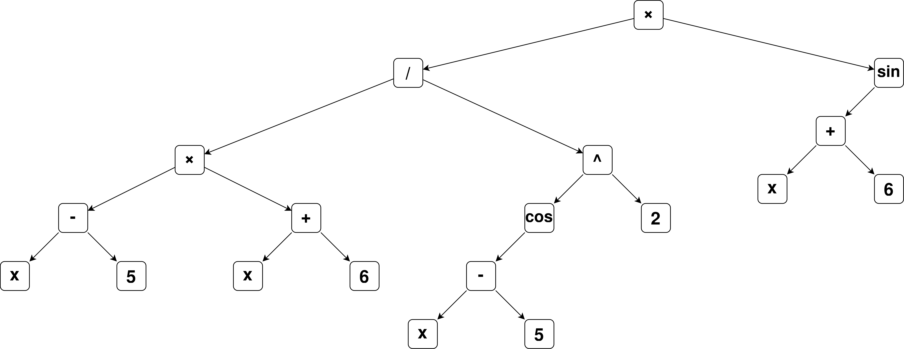

# Chapitre 7 - Exercice 31

## Enoncé

Implantez l'expression suivante en architecture 32 bits en utilisant la FPU :

$$
\frac{{(x-5)}\times{(x+6)}}{cos(x-5)^2}\times{sin(x+6)}
$$

1. on commencera par dessiner l’expression sous forme d’arbre binaire
2. puis on identifiera les sous-expressions qui sont répétées comme ${x-5}$ et ${x+6}$
3. on traduira l’expression non optimisée
4. puis on donnera une version en optimisant les calculs en ne recalculant pas à chaque fois les sous-expressions répétées

## 1. Arbre binaire

L'arbre correspondant à l'expression ci-dessus est :



## 2. Répétitions

Il y a deux occurrences des sous-expressions ${x-5}$ et ${x+6}$

## 3. Traduction

```Assembly
section .data

    cinq: dd 5.0
    six:  dd 6.0

section .text
global calcul_asm

; extern float calcul_c(float x)
calcul_asm:
    ; Prologue de la fonction
    push    ebp         ; sauvegarde de l'ancien base pointer
    mov     ebp, esp    ; esp devient le nouveau base pointer

    fld     dword [ebp + 8]
    fld     dword [cinq]
    fsubp

    fld     dword [ebp + 8]
    fld     dword [six]
    faddp

    fmulp

    fld     dword [ebp + 8]
    fld     dword [cinq]
    fsubp
    fcos
    fmul    st0                 ; Multiplication de st0 par st0 (équivalent au carré)

    fdivp

    fld     dword [ebp + 8]
    fld     dword [six]
    faddp
    fsin

    fmulp


    ; Épilogue de la fonction
    mov     esp, ebp        ; restaurer l'ancien esp
    pop     ebp             ; restaurer l'ancien base pointer
    ret                     ; retourner de la fonction
```

Que j'ai validé avec le code suivant :

```C
#include <stdio.h>
#include <math.h>

// Déclaration de la fonction assembleur
extern float calcul_asm(float x);

float calcul_c(float x) {
    return (((x-5) * (x+6)) / (cos(x-5)*cos(x-5))) * sin(x+6);
}

int main() {

    float x = 1.2;

    printf("f_c(%.1f) = %f\n", x, calcul_c(x));
    printf("f_asm(%.1f) = %f\n", x, calcul_asm(x));

    return 0;
}
```

Je remarque une différence de `0,000001`, probablement due aux conversions (donc pertes de précision) implémentées par le compilateur.

## 4. Optimisation

Pour chaque résultat intermédiaire que je dois réutiliser plus tard dans le calcul, je l'enregistre dans une variable locale pour le recharger au lieu de refaire le calcul :

```Assembly
section .data

    cinq: dd 5.0
    six:  dd 6.0

section .text
global calcul_asm
global calcul_asm_opti

; extern float calcul_asm(float x)
calcul_asm:
    ; Code identique à la version précédente

; extern float calcul_asm_opti(float x)
calcul_asm_opti:
    ; Prologue de la fonction
    push    ebp         ; sauvegarde de l'ancien base pointer
    mov     ebp, esp    ; esp devient le nouveau base pointer

    sub     esp, 16

    fld     dword [ebp + 8]
    fld     dword [cinq]
    fsubp
    fst     qword [esp]     ; Chargement de x - 5 dans la première variable locale (loc1)
    ; Utilisation de qword pour ne pas perdre d'informations

    fld     dword [ebp + 8]
    fld     dword [six]
    faddp
    fst     qword [esp + 8] ; Chargement de x + 6 dans la deuxième variable locale (loc2)

    fmulp

    fld     qword [esp]     ; Chargement de loc1 (x - 5)
    fcos
    fmul    st0                 ; Multiplication de st0 par st0 (équivalent au carré)

    fdivp

    fld     qword [esp + 8] ; Chargement de loc2 (x + 6)
    fsin

    fmulp


    ; Épilogue de la fonction
    mov     esp, ebp        ; restaurer l'ancien esp
    pop     ebp             ; restaurer l'ancien base pointer
    ret                     ; retourner de la fonction
```

J'obtiens exactement le même résultat qu'avec la fonction non optimisée.