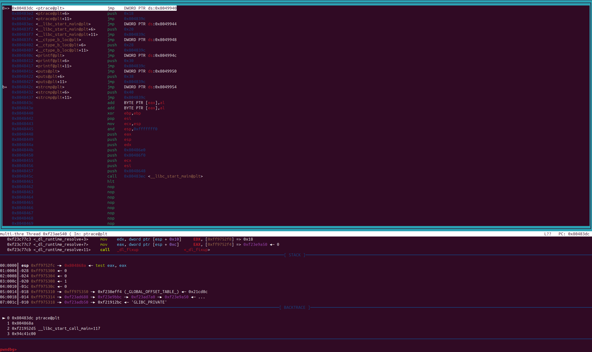
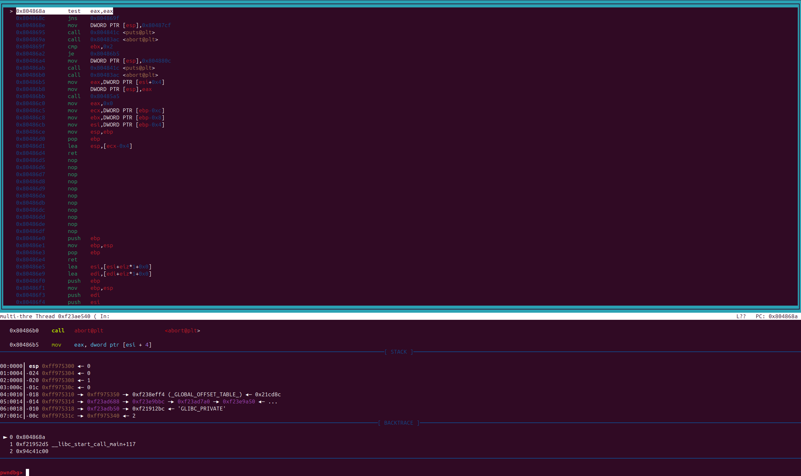
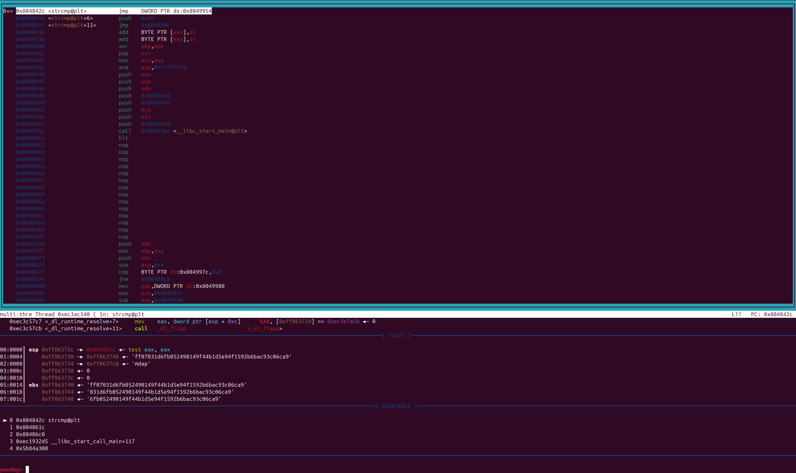

# Root-Me - ELF x86 - CrackPass

## Enoncé

Compilé avec : gcc -fno-stack-protector -o Crack && strip Crack sur Linux x86 (Debian)

Challenge : https://www.root-me.org/fr/Challenges/Cracking/ELF-x86-CrackPass

Niveau de difficulté : Moyen

## Solution

Le challenge met à notre disposition un exécutable nommé `Crack` auquel il faut fournir un mot de passe en argument. 

Pour commencer j'utilise Ghidra pour décompiler statiquement le programme. Je trouve la fonction principale et j'obtiens :

```C
undefined4 FUN_08048648(int param_1,int param_2)
{
    long lVar1;
    
    lVar1 = ptrace(PTRACE_TRACEME,0,1,0);
    if (lVar1 < 0) {
        puts("Don\'t use a debuguer !");
        /* WARNING: Subroutine does not return */
        abort();
    }
    if (param_1 != 2) {
        puts("You must give a password for use this program !");
        /* WARNING: Subroutine does not return */
        abort();
    }
    FUN_080485a5(*(undefined4 *)(param_2 + 4));
    return 0;
}
```

En analysant cette fonction, je comprends que le programme ne souhaite pas que j'utilise un debugger, qu'il attend un argument et que notre argument est passé à la fonction `FUN_080485a5`.

Je récupère son code :

```C
void FUN_080485a5(char *param_1)
{
    ushort **ppuVar1;
    int iVar2;
    char *pcVar3;
    char cVar4;
    char local_108c [128];
    char local_100c [4096];
    
    cVar4 = *param_1;
    if (cVar4 != '\0') {
        ppuVar1 = __ctype_b_loc();
        pcVar3 = param_1;
        do {
            if ((*(byte *)(*ppuVar1 + cVar4) & 8) == 0) {
                puts("Bad password !");
                /* WARNING: Subroutine does not return */
                abort();
            }
            cVar4 = pcVar3[1];
            pcVar3 = pcVar3 + 1;
        } while (cVar4 != '\0');
    }
    FUN_080484f4(local_100c,param_1);
    FUN_0804851c(s_THEPASSWORDISEASYTOCRACK_08049960,local_108c);
    iVar2 = strcmp(local_108c,local_100c);
    if (iVar2 == 0) {
        printf("Good work, the password is : \n\n%s\n",local_108c);
    }
    else {
        puts("Is not the good password !");
    }
    return;
}
```

Le programme détecte que mon mot de passe est correct lorsque la variable `iVar2` vaut `0`. `iVar2` contient la valeur retournée par la fonction `strcmp`. Je vais récupérer le contenu des variables envoyées à strcmp, peut-être que le mot de passe s'y trouve en clair, sinon ce sera une version chiffrée qu'il faudra déchiffrer.

Pour ce faire, je peux utiliser un debbuger, cependant, dans la première fonction, il y a une condition capable de détecter l'utilisation du debugger et empêche la suite de l'exécution du programme. Mais il est possible de modifier la valeur de la mémoire et des registres dans le debugger, il est donc possible de contourner cette condition si je la trouve. 

Je lance le debugger sur `Crack` avec l'option `--args` pour lui fournir un mot de passe incorrect qui permettra d'atteindre la dernière condition.

`gdb --args ./Crack mdp`

Je place des breakpoint sur les fonctions `ptrace` et `strcmp` :

```
rbreak ptrace
rbreak strcmp
```

Je charge le layout pour afficher les instructions assembleurs à venir avec `layout asm` puis je démarre l'exécution avec `run`. Ce qui donne :



Je ne vois pas la condition qui permet l'appel de la fonction `âbort`, je continue donc l'exécution instruction par instruction jusqu'à atteindre :



J'ai atteint une comparaison sur le registre `eax` suivi d'un saut conditionnel `jns`. Ici le programme s'assure que le contenu du registre `eax` n'est pas négatif.

Avec la commande `i r eax`, je sais que le registre `eax` contient `-1`. Je vais donc mettre ce dernier à `0` avec `set $eax = 0`. Puis je laisse le programme continuer jusqu'à atteindre l'appel de la fonction `strcmp` :



Il n'y a qu'un appel à la fonction `strcmp`, je sais donc où je me trouve dans le programme.

Les arguments ont déjà été ajoutés à la pile et le registre `esp` a été mis à jour en conséquence. Donc à l'adresse contenue dans `esp+4` se trouve le pointeur vers le premier argument et à l'adresse `esp+8` se trouve le pointeur vers le deuxième argument (les deux arguments étant des chaînes de caractères).

`esp = 0xff86372c`

```
0xff863730:	11111111100001100011011101000000
0xff863734:	11111111100001100011011111000000
```

Maintenant que j'ai l'adresse des deux chaines de caractères, je vais les lire.

J'ai :

```
0xff863740:	102 'f'	102 'f'	48 '0'	...
0xff863768:	...  	 99 'c'	97 'a'	57 '9'
```

Soit : `ff0[...]ca9`

Et :

```
0xff8637c0:	109 'm'	100 'd'	112 'p'	0 '\000'
```

Soit : `mdp`

Mon mot de passe n'a pas été modifié, donc l'autre chaîne de caractères que j'ai récupéré est probablement le mot de passe en clair.

```
$ ./Crack ff0[...]ca9     
Good work, the password is : 

ff0[...]ca9
```