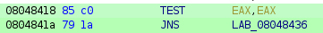

# Root-Me - ELF x86 - CrackPass

## Enoncé

Retrouvez le mot de passe permettant de valider ce challenge.

Challenge : https://www.root-me.org/fr/Challenges/Cracking/ELF-x86-Ptrace

Niveau de difficulté : Facile

## Solution

Lorsque j'essaye de lancer le programme avec gdb, j'ai le même suivant qui s'affiche : `Debugger detecté ... Exit`. Je décompile donc le programme avec ghidra puis trouve, dans la fonction main, la condition permettant au programme de détecter le debugger.

Je trouve l'appel à `ptrace` suivi d'une condition :

```C
lVar1 = ptrace(PTRACE_TRACEME,0,1,0);
if (lVar1 < 0) {
    puts(&DAT_080c2894);
    uVar2 = 1;
}
```

Ghidra me permet de facilement avoir l'instruction dans son fichier hexadécimal :



J'ouvre le programme avec hexedit et cherche l'instruction correspondante dans le fichier :

00000410   E8 5B 06 01  00 83 C4 10  85 C0 __79 1A__  83 EC 0C 68

Ghidra permet de modifier une instruction, je remplace donc `jns` par `jmp` ainsi le programme ne détectera plus le debugger. Ghidra remplace `79 1A` par `EB 1A`. J'applique la modification avec hexedit et je peux désormais lancer le programme avec gdb.

Ayant Ghidra ouvert, je récupère l'adresse du premier `cmp` utilisé par le programme pour vérifier le mot de passe. Je place un point d'arrêt à cette adresse (`0x080484a3`).

J'ai entré le mot de passe `azer`. Le programme compare le contenu des registres `dl` et `al`.

J'en affiche les valeurs :

```
(gdb) print/c $al
$3 = 101 'e'
(gdb) print/c $dl
$4 = 97 'a'
```

J'ai entré `a` mais le programme attend un `e`. Je modifie le registre `dl` en conséquence et je place un point d'arrêt sur la prochaine instruction `cmp`.

```
set $dl = 101
break *0x080484b2
```

J'affiche les nouvelles valeurs des deux registres :

```
(gdb) print/c $al
$5 = 97 'a'
(gdb) print/c $dl
$6 = 122 'z'
```

J'ai entré un `z` alors qu'un `a` était attendu. Je modifie le registre `dl` en conséquence et je place un point d'arrêt sur la prochaine instruction `cmp`.

```
set $dl = 97
break *0x080484bf
```

J'affiche les nouvelles valeurs des deux registres :

```
(gdb) print/c $al
$7 = 115 's'
(gdb) print/c $dl
$8 = 101 'e'
```

J'ai entré un `e` alors qu'un `s` était attendu. Je modifie le registre `dl` en conséquence et je place un point d'arrêt sur la prochaine instruction `cmp`.

```
set $dl = 115
break *0x080484ce
```

J'affiche les nouvelles valeurs des deux registres :

```
(gdb) print/c $al
$9 = 121 'y'
(gdb) print/c $dl
$10 = 114 'r'
```

J'ai entré un `r` alors qu'un `y` était attendu. Je modifie le registre `dl` en conséquence mais je ne trouve plus d'instruction `cmp` je vais donc laisser le programme finir.

```
set $dl = 121
c
```

Le programme affiche `Good password !!!`. J'ai donc trouvé le mot de passe qui est `easy`.